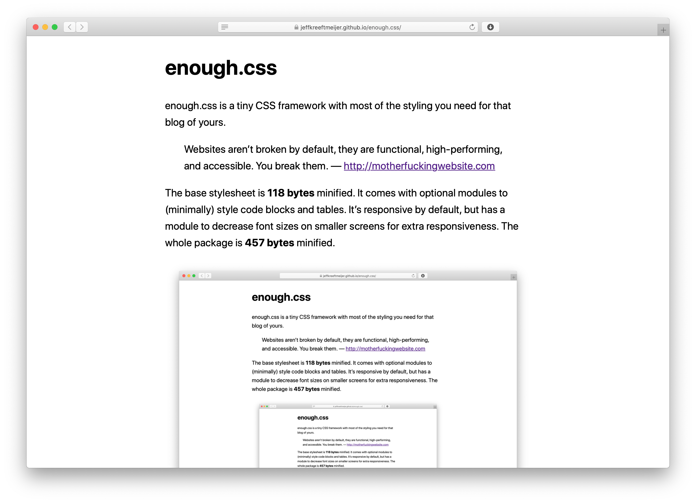

# enough.css

enough.css is a tiny CSS framework with most of the styling you need for that blog of yours.

> Websites aren't broken by default, they are functional, high-performing, and accessible. You break them. &#x2014; <http://motherfuckingwebsite.com>

The base stylesheet is **118 bytes** minified. It comes with optional modules to (minimally) style code blocks and tables. It's responsive by default, but has a module to decrease font sizes on smaller screens for extra responsiveness. The whole package is **478 bytes** minified.

[](https://jeffkreeftmeijer.github.io/enough.css/)

It's an experiment to see how little CSS a blog can get away with while still looking good and being readable on big and small screens. It styles pages without having to add extra markup like wrapper `<div>`​s and CSS classes.

Besides the base style sheet, it comes modules for styling specific tags. These are included in `enough.min.css` by default, but you can build your own to save some bytes if your project doesn't need everything.

Some of the rules are duplicated across modules so they don't depend on each other, but [cssnano](https://cssnano.co) takes them out when minifying.


# enough.css

-   Increases the font size to 22px
-   Uses `system-ui` if available, or falls back to a sans-serif font
-   Uses a 1.6em `line-height`
-   Makes the body 35em wide with 1em left- and right paddings, and centers it
-   Adds a 100% `max-width` to images and videos, so they can't overflow.
-   Sets image height to `auto` to resize proportionally when width and height are set


# enough.code.css

-   Uses a `smaller` font-size in `<pre>` tags
-   Uses `ui-monospace` (which is SF Mono on [Safari ≥ 13.1](https://caniuse.com/extended-system-fonts)), `SFMono-Regular` (SF Mono on Chrome) or Monaco as the font in `<pre>`, `<code>`, and `<kbd>` tags, or falls back to the system's monospace font
-   Adds an overflow to `<pre>` tags so long lines show horizontal scroll bars
-   Adds a 1em padding to `<pre>` tags
-   Adds a `ghostwhite` background color to `<pre>` tags


# enough.media.css

| Maximum viewport width | Body font size | Max. viewport calculation |
|---------------------- |-------------- |------------------------- |
| 1140px                 | 20px           | (35em + 2em) × 22px × 1.4 |
| 740px                  | 18px           | (35em + 2em) × 20px       |
| 466px                  | 16px           | (35em + 2em) × 18px × 0.7 |


# enough.table.css

-   Adds a 100% `width` to tables.
-   Uses a 0.5em padding in table cells
-   Adds collapsed, 1px borders


# enough.min.css

```
$ npm install
$ cat enough.css enough.media.css enough.code.css enough.table.css | node_modules/.bin/cssnano > enough.min.css
```

---

-   [Interactive Demo™](https://jeffkreeftmeijer.github.io/enough.css)
-   [Code](https://github.com/jeffkreeftmeijer/enough.css)